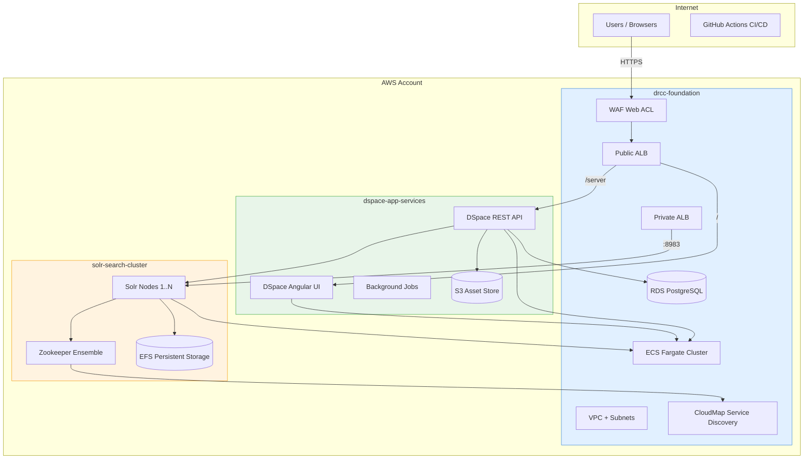

# JHU DRCC Terraform Modules

Reusable Terraform/OpenTofu modules for deploying containerized applications on AWS. Built by the JHU Digital Research and Curation Center for production use by students, faculty, and staff.

## Modules

| Module | Purpose | Dependencies |
|--------|---------|--------------|
| [drcc-foundation](./modules/drcc-foundation/) | VPC, ECS cluster, ALBs, RDS, IAM, WAF, service discovery | None |
| [solr-search-cluster](./modules/solr-search-cluster/) | Multi-node Solr cluster with Zookeeper on ECS/EFS | drcc-foundation |
| [dspace-app-services](./modules/dspace-app-services/) | DSpace Angular UI, REST API, background jobs, S3 asset store | drcc-foundation |

## Architecture



## Quick Start

### Prerequisites

- OpenTofu >= 1.6 or Terraform >= 1.0
- AWS CLI configured with appropriate credentials
- SSL certificate in ACM (or set `create_ssl_certificate = true`)

### Deploy

```bash
git clone https://github.com/jhu/terraform-aws-jhu-drcc.git
cd terraform-aws-jhu-drcc/examples/complete

cp prod.tfvars.example prod.tfvars
# Edit prod.tfvars — update [REQUIRED] values for your institution

tofu init
tofu plan -var-file=prod.tfvars

# Deploy in stages
tofu apply -target=module.foundation -var-file=prod.tfvars
tofu apply -target=module.solr -var-file=prod.tfvars
tofu apply -target=module.dspace_app -var-file=prod.tfvars
```

See the [Production Deployment Guide](./examples/complete/PRODUCTION.md) for hardening, scaling, and operational guidance.

## Usage

```hcl
module "foundation" {
  source = "github.com/jhu/terraform-aws-jhu-drcc//modules/drcc-foundation?ref=v2.0.0"

  organization = "jhu"
  project_name = "dspace"
  environment  = "prod"
  aws_region   = "us-east-1"

  create_vpc           = true
  vpc_cidr             = "10.0.0.0/16"
  public_subnet_cidrs  = ["10.0.1.0/24", "10.0.2.0/24", "10.0.3.0/24"]
  private_subnet_cidrs = ["10.0.11.0/24", "10.0.12.0/24", "10.0.13.0/24"]

  deploy_database      = true
  db_instance_class    = "db.r5.xlarge"
  db_allocated_storage = 500
}

module "solr" {
  source = "github.com/jhu/terraform-aws-jhu-drcc//modules/solr-search-cluster?ref=v2.0.0"

  organization = "jhu"
  project_name = "dspace"
  environment  = "prod"
  aws_region   = "us-east-1"

  vpc_id                           = module.foundation.vpc_id
  private_subnet_ids               = module.foundation.private_subnet_ids
  ecs_cluster_id                   = module.foundation.ecs_cluster_id
  ecs_cluster_arn                  = module.foundation.ecs_cluster_arn
  ecs_cluster_name                 = module.foundation.ecs_cluster_name
  service_discovery_namespace_id   = module.foundation.service_discovery_namespace_id
  service_discovery_namespace_name = module.foundation.service_discovery_namespace_name

  solr_node_count  = 5
  deploy_zookeeper = true
}

module "dspace_app" {
  source = "github.com/jhu/terraform-aws-jhu-drcc//modules/dspace-app-services?ref=v2.0.0"

  organization = "jhu"
  project_name = "dspace"
  environment  = "prod"
  aws_region   = "us-east-1"

  vpc_id                   = module.foundation.vpc_id
  private_subnet_ids       = module.foundation.private_subnet_ids
  ecs_cluster_id           = module.foundation.ecs_cluster_id
  ecs_cluster_arn          = module.foundation.ecs_cluster_arn
  alb_https_listener_arn   = module.foundation.alb_https_listener_arn
  private_alb_listener_arn = module.foundation.private_alb_listener_arn

  dspace_angular_task_count = 4
  dspace_api_task_count     = 4
}
```

## Examples

| Example | Description |
|---------|-------------|
| [complete](./examples/complete/) | Full DSpace stack (foundation + Solr + app services) |
| [foundation-only](./examples/foundation-only/) | Shared infrastructure without application modules |
| [with-solr](./examples/with-solr/) | Foundation + Solr cluster without DSpace |

## Version Pinning

```hcl
# Pin to exact version (recommended for production)
source = "github.com/jhu/terraform-aws-jhu-drcc//modules/drcc-foundation?ref=v2.0.0"

# Pin to minor version
source = "github.com/jhu/terraform-aws-jhu-drcc//modules/drcc-foundation?ref=v2.0"
```

## AWS Cost Estimates

| Profile | Configuration | Estimated Monthly Cost |
|---------|--------------|----------------------|
| Evaluation | Single-AZ, minimal instances, 1 Solr + 2 DSpace tasks | ~$195–245 |
| Production | Multi-AZ, HA, 5 Solr + 8 DSpace tasks, RDS Multi-AZ | ~$1,660–2,515 |


## Adding a Module

```
modules/your-module-name/
├── main.tf
├── variables.tf
├── outputs.tf
├── versions.tf
└── README.md        # auto-generated via terraform-docs
```

Generate docs with:

```bash
tofu-docs markdown table --output-file README.md --output-mode inject modules/your-module-name
```

## Contributing

Contributions are welcome from JHU DRCC staff and faculty. We are not currently accepting outside contributions.

## Support

- Slack: #dev-ops (JHU Libraries)
- Email: devops@library.jhu.edu
- [GitHub Issues](https://github.com/jhu/terraform-aws-jhu-drcc/issues)

## License

[MIT](./LICENSE)
