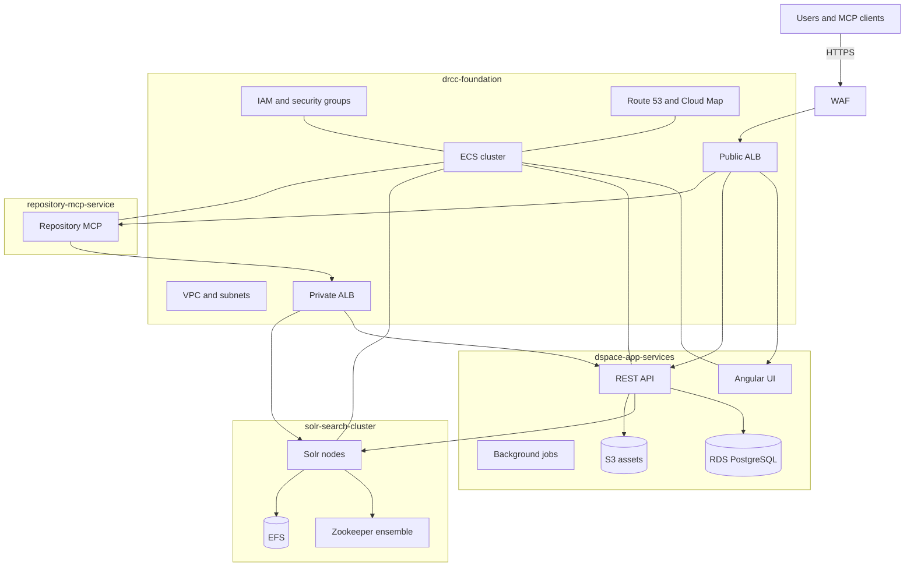

# JHU DRCC Terraform Modules

Reusable Terraform/OpenTofu modules for containerized research-repository services on AWS. The library composes shared networking and ECS infrastructure with DSpace, Solr, and Repository MCP application modules.

## Modules

| Module | Purpose | Dependencies |
|---|---|---|
| [drcc-foundation](./modules/drcc-foundation/) | VPC, ECS cluster, public/private ALBs, IAM, WAF, TLS, and service discovery | None |
| [dspace-app-services](./modules/dspace-app-services/) | DSpace Angular, REST API, background jobs, S3 asset store, and optional managed RDS | drcc-foundation |
| [solr-search-cluster](./modules/solr-search-cluster/) | Multi-node Solr and optional Zookeeper on ECS/EFS | drcc-foundation, database endpoint/secret |
| [repository-mcp-service](./modules/repository-mcp-service/) | Federated JScholarship/JHRDR MCP service on ECS Fargate | drcc-foundation, repository backends |

`modules/vireo-app-services` is not a published module; it contains no tracked Terraform configuration.

## Architecture


```mermaid
graph TB
    Users[Users and MCP clients] -->|HTTPS| WAF[WAF]
    WAF --> PublicALB[Public ALB]

    subgraph Foundation[drcc-foundation]
        VPC[VPC and subnets]
        ECS[ECS cluster]
        PublicALB
        PrivateALB[Private ALB]
        IAM[IAM and security groups]
        DNS[Route 53 and Cloud Map]
    end

    subgraph DSpace[dspace-app-services]
        UI[Angular UI]
        API[REST API]
        Jobs[Background jobs]
        RDS[(RDS PostgreSQL)]
        Assets[(S3 assets)]
    end

    subgraph Search[solr-search-cluster]
        Solr[Solr nodes]
        ZK[Zookeeper ensemble]
        EFS[(EFS)]
    end

    subgraph MCPService[repository-mcp-service]
        MCP[Repository MCP]
    end

    PublicALB --> UI
    PublicALB --> API
    PublicALB --> MCP
    PrivateALB --> API
    PrivateALB --> Solr
    API --> RDS
    API --> Solr
    API --> Assets
    Solr --> ZK
    Solr --> EFS
    MCP --> PrivateALB
    ECS --- UI
    ECS --- API
    ECS --- Solr
    ECS --- MCP
    DNS --- ECS
    IAM --- ECS
```

Database creation belongs to `dspace-app-services`. Foundation retains deprecated existing-database lookup outputs only for compatibility and rejects `deploy_database = true` with migration guidance.

## Requirements

- OpenTofu or Terraform `>= 1.6`
- AWS provider `~> 5.0`
- AWS credentials with least-privilege permissions for the selected modules
- Remote state with locking for shared or production environments
- A reviewed TLS certificate and DNS strategy

## Quick start

Use the complete example as the deployment root:

```bash
git clone https://github.com/jhu-library-devops/terraform-aws-jhu-drcc.git
cd terraform-aws-jhu-drcc/examples/dspace-complete
cp stage.tfvars.example stage.tfvars
# Replace all example domains, account IDs, ARNs, image tags, and addresses.

tofu init
tofu plan -var-file=stage.tfvars -out=stage.tfplan
tofu apply stage.tfplan
```

Review [the production guide](./examples/dspace-complete/PRODUCTION.md) before a production deployment and follow [the migration and rollback guide](./MIGRATION.md) for existing state. Do not use routine targeted applies for this composition: cross-module IAM and reciprocal security-group rules must be planned and upgraded together.

## Source pinning

This repository does not currently publish a release tag. For remote module consumers, replace `<release-tag>` with a real reviewed release tag once one is published:

```hcl
module "foundation" {
  source = "github.com/jhu-library-devops/terraform-aws-jhu-drcc//modules/drcc-foundation?ref=<release-tag>"

  # See examples/foundation-only for the complete input contract.
}
```

Before the first release, pinning a reviewed full Git commit SHA is safer than a branch. Never use an unpinned branch for production.

## Examples

| Example | Description |
|---|---|
| [dspace-complete](./examples/dspace-complete/) | Full foundation, DSpace-managed RDS, Solr/Zookeeper, and DSpace services |
| [foundation-only](./examples/foundation-only/) | Shared infrastructure without application services or RDS |
| [with-solr](./examples/with-solr/) | Foundation and Solr using an explicit external database contract |
| [repository-mcp](./examples/repository-mcp/) | Repository MCP on foundation with explicit backend security-group contracts |

## Security-group composition

Application modules create explicit reciprocal rules for required paths instead of relying on broad outbound access. Upgrade foundation, Solr, and Repository MCP together when adopting these contracts. A security-group rule that references a caller-owned group must have exactly one Terraform state owner; importing or removing a duplicate owner is a deployment migration, not an in-place code-only change.

## Documentation

Module API tables are generated with [terraform-docs](https://terraform-docs.io/):

```bash
terraform-docs markdown table --output-file README.md --output-mode inject modules/drcc-foundation
```

## Contributing and support

Contributions are welcome from JHU DRCC staff and faculty. Report issues through [GitHub Issues](https://github.com/jhu-library-devops/terraform-aws-jhu-drcc/issues). Never commit credentials, private endpoints, state files, plans, or unreviewed repository data.

## License

[MIT](./LICENSE)

<!-- BEGIN_TF_DOCS -->

<!-- END_TF_DOCS -->
